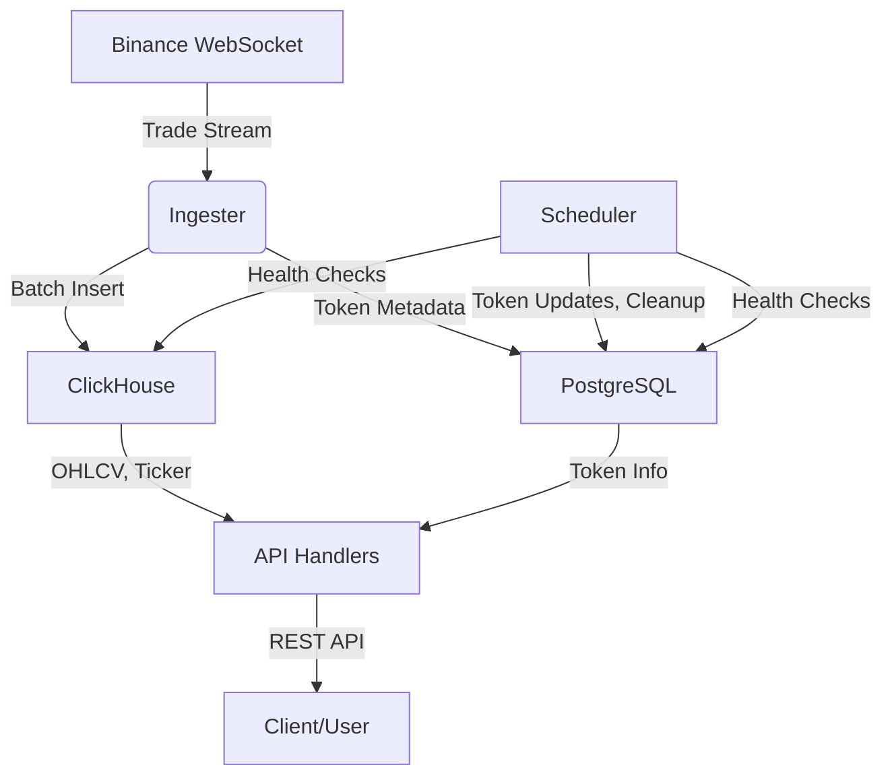

# Trading Platform Backend

## Overview

This project is a real-time cryptocurrency trading backend that ingests live trade data from Binance, stores it in ClickHouse and PostgreSQL, and exposes a RESTful API for candlestick (OHLCV) and ticker data. It is designed for high performance, scalability, and extensibility, leveraging Go, Gin, ClickHouse, PostgreSQL, and Docker.

---

## Architecture



---

## Main Components

### 1. **Data Ingester (`internal/ingester/binance.go`)**

- Connects to Binance WebSocket for real-time trade data.
- Batches and inserts trades into ClickHouse.
- Handles reconnection, batching, and error recovery.

### 2. **Database Layer (`internal/db/`)**

- **ClickHouse**: Stores high-frequency trade and OHLCV data for analytics and fast queries.
- **PostgreSQL**: Stores token metadata (name, category, market cap, etc.).
- Schema initialization and health checks are managed at startup.

### 3. **API Handlers (`internal/handler/`)**

- **OHLCV Handler**: Serves candlestick data for trading pairs, supports interval/limit queries, and lists supported symbols.
- **Ticker Handler**: Serves latest price, 24h stats, and token metadata for all or specific symbols.

### 4. **Scheduler (`internal/scheduler/`)**

- Runs background jobs (token metadata updates, health checks, data cleanup) using cron.
- Extensible for additional scheduled tasks.

### 5. **Configuration (`internal/config/`)**

- Loads environment variables for all services (DB, Binance, server, etc.).
- Supports `.env` files and system environment.

### 6. **Logging (`pkg/utils/logger.go`)**

- Structured logging with zap.
- Gin middleware for HTTP request logging.

---

## API Endpoints

Base path: `/api/v1`

| Endpoint          | Method | Description                                  |
| ----------------- | ------ | -------------------------------------------- |
| `/ticker`         | GET    | Get latest ticker data for all symbols       |
| `/ticker/:symbol` | GET    | Get latest ticker data for a specific symbol |
| `/ohlcv/:symbol`  | GET    | Get OHLCV candlestick data for a symbol      |
| `/ohlcv/symbols`  | GET    | List all supported trading pairs             |
| `/health`         | GET    | Health check for DB and service status       |

---

## Database Design

### ClickHouse

- **trades**: Raw trade data (symbol, price, quantity, trade_id, timestamp, is_buyer_maker)
- **trades_ohlcv_1m**: Materialized view for 1-minute OHLCV data

### PostgreSQL

- **tokens**: Metadata for each token (symbol, name, category, market cap, etc.)

---

## Data Ingestion Flow

1. **WebSocket Connection**: Ingester connects to Binance and subscribes to trade streams for configured symbols.
2. **Batch Processing**: Trades are batched and inserted into ClickHouse for efficiency.
3. **Materialized Views**: ClickHouse automatically aggregates trades into OHLCV data.
4. **API Access**: Handlers query ClickHouse/PostgreSQL to serve API requests.

---

## Scheduler/Background Jobs

- **Token Metadata Update**: Fetches and updates token info from external APIs (e.g., CoinGecko) hourly.
- **Health Checks**: Periodically checks DB health.
- **Data Cleanup**: Removes old data as per retention policy.

---

## Configuration

- All configuration is via environment variables (see `internal/config/config.go`).
- Example variables:
  - `POSTGRES_HOST`, `POSTGRES_PORT`, `POSTGRES_DATABASE`, `POSTGRES_USERNAME`, `POSTGRES_PASSWORD`
  - `CLICKHOUSE_HOST`, `CLICKHOUSE_PORT`, `CLICKHOUSE_DATABASE`, `CLICKHOUSE_USERNAME`, `CLICKHOUSE_PASSWORD`
  - `BINANCE_WS_URL`, `SERVER_PORT`, `ENVIRONMENT`
- Supports `.env` file for local development.

---

## Development & Deployment

### Prerequisites

- Go 1.23+
- Docker & Docker Compose

### Local Development

```sh
# Build and run locally
make build
make run

# Run tests
make test

# Lint and format
make lint
make fmt
```

### Docker Compose

```sh
# Start all services (app, Postgres, ClickHouse)
docker-compose up --build

# Stop services
docker-compose down
```

### Production Build

```sh
# Build Docker image
docker build -t trading-backend:latest .

# Run container
# (ensure Postgres and ClickHouse are running and accessible)
docker run --rm -p 8080:8080 trading-backend:latest
```

---

## Logging & Observability

- Uses zap for structured, high-performance logging.
- HTTP requests are logged via Gin middleware.
- Log level configurable via `LOG_LEVEL` env variable.

---

## Extensibility

- Add new data sources by implementing additional ingesters.
- Add new scheduled jobs in `internal/scheduler/`.
- Extend API by adding new handlers/routes in `internal/handler/`.

---
